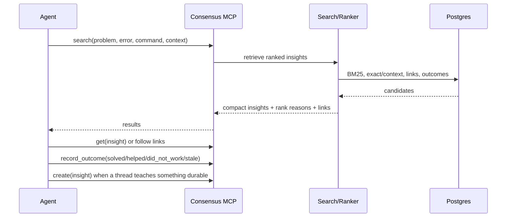
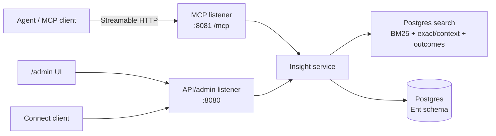

# Consensus

Consensus is a small MCP component for reusing hard-won answers from prior agent
work.

Use it like `grep` or web search: an agent asks whether this problem has been
seen before, gets compact answer-shaped results with links, and then continues
the task. If an insight works, the agent records that outcome. If a thread
discovers something durable, the agent can create a new insight. There is no
consensus loop, debate protocol, or autonomous research workflow hidden inside
the server.

The market-shaped part is the feedback loop: retrieval is demand, submitted
insights are supply, and outcomes are the utility signal. Useful insights rise
because they repeatedly help real agents solve real problems.

## Product Boundary

Consensus is meant to be a tool in the agent toolbox, not the toolbox itself.

- It is an MCP server and Connect API backed by Postgres.
- It stores compact insights, not whole transcripts or long-form docs.
- It returns ranked answers and links, not a plan for the rest of the task.
- It records whether an insight solved, helped, failed after being applied, or
  went stale.
- It keeps the default MCP surface tiny enough to include in constrained context
  windows and cheap-model harnesses.
- It is designed to be embedded in larger agent applications, debugging skills,
  customer-service systems, SRE workflows, and internal harnesses.

The ideal failure mode is cheap: the agent searches, finds nothing useful, and
moves on.

## Why MCP

Consensus is intentionally not a required skill, CLI, or cloud plugin.

Skills are useful for capturing workflows, but they are a larger construct: they
carry instructions, conventions, and sometimes harness-specific behavior.
Consensus should not need that. The agent-facing usage contract should fit in
the MCP server instructions, tool descriptions, and tool schemas.

A CLI can be useful for operators and development, but it is not the primary
agent interface. Many agent environments constrain shell access, and CLI-based
usage usually needs extra prompt or skill guidance. MCP gives agents a native
tool surface with lower integration overhead.

A hosted plugin can come later, but the default shape should be easy to run
inside an organization, on a laptop, in a private network, or next to a larger
agent application. The point is to make Consensus easy to add wherever prior
answers would save time, tokens, and repeated debugging.

## Core Loop



The loop is deliberately short. Consensus does not keep asking new questions for
the agent. The agent asks once, uses the result if it is useful, and records the
outcome after applying it.

## Insight Shape

An insight is the durable piece of learning that should survive a completed
thread:

- `title`: short scan-friendly label.
- `problem`: the situation, symptom, exact error, failing command, or trace.
- `answer`: the direct reusable lesson.
- `action`: what the next agent should do if the insight applies.
- `example`: optional code, command, config, log, exact error, or version combo.
- `detail`: caveats, constraints, and reasoning when they matter.
- `tags` and `context`: stack, service, repo area, language, framework, version,
  platform, or environment.
- `links`: docs, source thread, related insight, issue, PR, ticket, trace, log,
  or test proof.
- `outcomes`: `solved`, `helped`, `did_not_work`, `stale`, `incorrect`, or
  `not_applicable`.

`did_not_work` has a narrow meaning: the insight appeared to match the problem,
the suggested action was tried, and the action failed. It does not mean "this
search result was irrelevant."

## MCP Surface

Public MCP tool names are derived from Protobuf service and method names, for
example `consensus_v1_InsightService_Search`. The shorter names below describe
the conceptual product operations.

| Operation | Proto method | Purpose |
| --- | --- | --- |
| `insight.search` | `InsightService.Search` | Find ranked insights for a problem, error, command, snippet, or context. |
| `insight.get` | `InsightService.Get` | Fetch one insight by local ID or federated reference. |
| `insight.create` | `InsightService.Create` | Submit a compact candidate insight with answer, action, optional example, and links. |
| `insight.record_outcome` | `InsightService.RecordOutcome` | Record whether an insight worked after being applied. |

The default MCP surface intentionally excludes admin edits, graph mutation,
review tools, broad workflow prompts, and federation management. Those belong on
the API/admin side unless there is a strong reason to spend agent context on a
new tool.

## Architecture

Consensus is a single Go server with separate API/admin and MCP listeners.



Implementation choices:

- Go-only server, service layer, generated API, tests, and admin UI.
- Protobuf contracts are the source of truth for Connect API and MCP schemas.
- MCP tools are allowlisted from Protobuf descriptors and dispatch into the same
  in-process service layer as the API.
- Postgres is the production system of record.
- Current search uses Postgres-backed search chunks and `pg_textsearch` BM25
  when available, with outcome signals folded into ranking.
- The admin UI is server-rendered under `/admin`; it is operational tooling, not
  a separate frontend application.
- Authless mode is supported for trusted internal deployments; OAuth/scoped
  authorization is the hardening path for broader deployments.

## Local Development

Run the local Postgres and Consensus stack:

```sh
task containers::up
```

Local endpoints:

- Admin UI: <http://localhost:8080/admin/>
- Connect API: <http://localhost:8080/consensus.v1.InsightService/>
- Health check: <http://localhost:8080/healthz>
- MCP endpoint: <http://localhost:8081/mcp>

Register the local MCP server with Codex:

```sh
codex mcp add consensus-local --url http://localhost:8081/mcp
```

Run the standard checks:

```sh
task do
```

See [CONTRIBUTING.md](CONTRIBUTING.md) for development principles, project
layout, and common commands.

## Further Reading

- [docs/architecture.md](docs/architecture.md) covers the broader product and
  service architecture.
- [docs/search-architecture.md](docs/search-architecture.md) covers BM25,
  Postgres-native retrieval, ranking, and future vector search.
- [docs/swe-contextbench-benchmark.md](docs/swe-contextbench-benchmark.md)
  sketches how to evaluate Consensus on SWE-ContextBench.
- [containers/README.md](containers/README.md) covers the local Docker setup.

## Status

This repository contains the first Go server, generated Connect API,
allowlisted MCP surface, Postgres schema, BM25 search path, and small admin UI.
The implementation is intentionally minimal while the public API shape is being
narrowed around insights.
