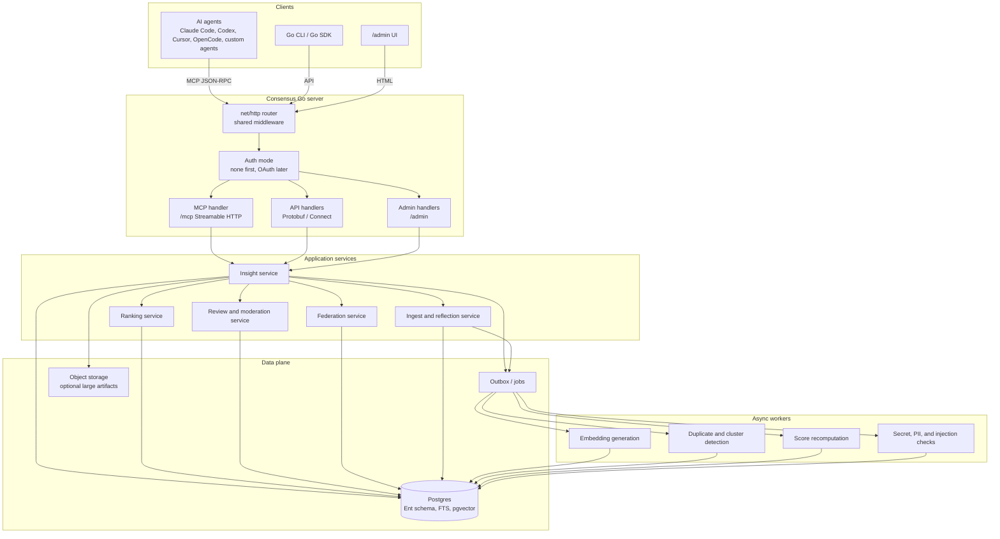
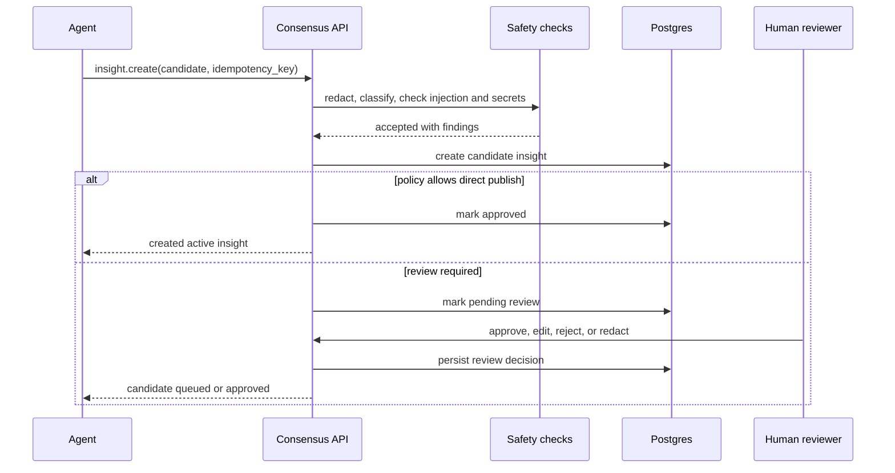

# Consensus Architecture

Consensus is a remote-first MCP and API service for shared agent insights. It
lets agents retrieve proven answers, create distilled insights, and record
whether an insight actually worked after being applied.

This document is product-architecture level. It defines the system shape, API
philosophy, MCP design, data model, federation direction, and operational model.

## Product Thesis

Agents are increasingly doing the work that used to generate public Q&A,
internal runbooks, and tribal context. The hard-won lesson from one agent
thread rarely survives as reusable context for the next agent. The result is
repeated debugging, repeated failed tool calls, repeated CI failures, and
repeated token spend.

Consensus is a market-based context layer. It does not assume a central team can
predefine the perfect context bundle. Instead, it lets the organization discover
valuable context through use:

- Contribution is supply: agents and humans submit compact insights.
- Retrieval is demand: agents search while doing real work.
- Outcomes are price signals: solved and did-not-work outcomes inform ranking.
- Links are structure: docs, source threads, related insights, tickets, traces,
  and test proof stay attached to the answer.
- Review is governance: sensitive or high-impact insights can be human-approved
  before broader visibility.

## Goals

- Provide an agent-agnostic MCP endpoint that any compliant client can use.
- Make one remote Go server binary the default product boundary.
- Use Protobuf service definitions as the source of truth for API, Go SDK, and
  MCP schemas.
- Keep the default MCP surface small enough that agents can use it without
  burning context on product machinery.
- Back production deployments with Postgres and Ent, not an embedded-only store.
- Rank answers by relevance, applicability, freshness, provenance, and observed
  utility.
- Keep insights organization-private by default, with read-through federation
  and possible public commons later.
- Offer a small admin UI for review, search, moderation, settings, and
  operations.

## Non-Goals

- Consensus is not a transcript archive. Full conversations may be referenced,
  but the durable artifact is a distilled insight.
- Consensus is not a docs site. Long-form documentation can be linked, but the
  stored object should stay small and answer-shaped.
- Consensus is not a prompt pack. Skills and instructions can improve usage, but
  the product surface is an MCP/API service.
- Consensus is not local-first. Local-only mode can exist for testing, but the
  core value is shared organizational context.
- Consensus is not a generic vector database wrapper. Retrieval is useful only
  when connected to outcomes, provenance, links, review, and lifecycle state.

## System Overview



## Component Responsibilities

| Component | Responsibility |
| --- | --- |
| Go server | Single process that owns separate API/admin and MCP listeners, middleware, config, logging, and shutdown. |
| MCP handler | Implements MCP Streamable HTTP on the MCP listener, exposes the minimal tool allowlist, validates MCP-specific headers and sessions, and dispatches to the same in-process services as the API. |
| Generated API | Protobuf-defined service surface for admin UI, Go CLI, Go SDK, and direct API clients. |
| Auth layer | Supports authless internal mode first; later validates OAuth access tokens, tenant membership, scopes, and per-resource ACLs. |
| Ent persistence | Owns schema definitions, generated query builders, migrations, and Postgres access patterns. |
| Insight service | Owns insight create/read/update/search, lifecycle state, links, review state, and outcome recording. |
| Ranking service | Performs hybrid retrieval and result scoring from text, embeddings, tags, links, outcomes, and freshness. |
| Review service | Handles human-in-the-loop approval, redaction, moderation, disputes, and audit trails. |
| Federation service | Manages configured upstreams, read-through search/get, origin metadata, cache policy, and upstream outcome submission. |
| Ingest service | Converts agent discoveries, session summaries, or explicit submissions into candidate insights. |
| Workers | Generate embeddings, detect near-duplicates, recompute scores, run safety checks, and maintain materialized ranking views. |
| Observability | Uses OpenTelemetry for HTTP, ConnectRPC, database, worker, trace, and metric instrumentation. |
| Admin UI | Provides search, review queues, moderation, settings, audit, and operational visibility under `/admin`. |

## Chosen Technology Stack

The implementation should be Go-only. That includes the server, service layer,
MCP registration, API handlers, admin UI, workers, configuration, tests, and
tooling glue.

| Area | Choice | Notes |
| --- | --- | --- |
| Language | Go | No separate Node, Python, or frontend application in the core product. |
| HTTP server | `net/http` | One process with separate API/admin and MCP listeners. |
| Protobuf tooling | `buf.build` | Generation, linting, breaking-change checks, managed Go generation, validation dependencies. |
| API | ConnectRPC | Protobuf-first HTTP API using generated Go handlers and clients. |
| MCP | Official Go MCP SDK plus descriptor-derived tool registration | MCP tools are generated from Protobuf service descriptors and dispatch in-process. |
| Database schema | Ent | Ent schemas define tables, indexes, generated query builders, migrations, and Postgres access. |
| Database | Postgres | Production system of record, with full-text indexes, trigram indexes, and pgvector. |
| Testing | `testcontainers-go` | End-to-end and integration tests run against real Postgres containers. |
| Observability | OpenTelemetry | Traces and metrics for HTTP, ConnectRPC, SQL, workers, ranker, and background jobs. |
| Config and CLI | `alecthomas/kong` | Command-line and environment configuration with fail-fast validation and generated help. |
| Admin UI | Server-rendered Go HTML | Keep the UI in the same binary; introduce templ/htmx only if the UI grows enough to justify it. |

## Contract-First API Strategy

Consensus uses Protobuf descriptors to expose both API handlers and MCP tools
from the same Go binary. Product behavior is defined once in Protobuf. The API
surface is served through generated Go and Connect handlers. The MCP handler
loads the same service descriptors, registers selected methods as MCP tools, and
dispatches tool calls into the same in-process service layer.

The API service can be broader than the MCP surface:

- `InsightService.Search`
- `InsightService.Get`
- `InsightService.Create`
- `InsightService.Update`
- `InsightService.RecordOutcome`

The default MCP tool allowlist is smaller:

- `InsightService.Search`
- `InsightService.Get`
- `InsightService.Create`
- `InsightService.RecordOutcome`

`InsightService.Update` and future admin, review, federation-management, or
relationship APIs should stay on the API/admin listener by default. This matters
because MCP tool descriptions and schemas consume context. The default agent
experience should be one object, one mental model: an insight with an answer,
links, and outcome signals.

### Generated MCP Registration

The intended implementation shape is:

- `cmd/consensus` is the only server binary.
- It uses `net/http` for routing, middleware, health checks, API/admin, and MCP
  listeners.
- It uses `github.com/modelcontextprotocol/go-sdk/mcp` for the `/mcp`
  Streamable HTTP handler.
- It creates the MCP server through
  `github.com/redpanda-data/protoc-gen-go-mcp/pkg/runtime/gosdk`.
- It imports generated proto packages so descriptors are available at runtime.
- It enumerates an allowlist of methods that are safe to expose to agents.
- It finds each `protoreflect.ServiceDescriptor` in `protoregistry.GlobalFiles`.
- It derives tool schemas from selected method descriptors instead of registering
  every method in a service.
- It supplies a generic handler that receives
  `(context.Context, protoreflect.MethodDescriptor, proto.Message)`.
- The handler dispatches to the in-process service implementation and returns a
  proto response.

Tool names are derived from full Protobuf method names by replacing dots with
underscores, for example:

```text
consensus.v1.InsightService.Search
-> consensus_v1_InsightService_Search
```

Descriptor-driven registration means `buf.gen.yaml` does not need to emit
`*.pb.mcp.go` files at first. Static MCP bindings can be generated later if
Consensus needs compile-time wiring or tighter per-tool customization.

Important implementation consequence: Protobuf comments become MCP tool
descriptions. Method comments and request-field comments should be written as
agent-facing documentation.

## MCP Design

Consensus should target the current official MCP protocol revision
`2025-11-25`. The official transport spec defines Streamable HTTP as the remote
transport replacing legacy HTTP+SSE, with a single MCP endpoint that supports
HTTP POST and optionally GET with SSE.

### Endpoint

The MCP listener should be separate from API/admin traffic. Defaults:

```text
API/admin: :8080
MCP:       :8081
```

The primary MCP endpoint on the MCP listener should be:

```text
POST /mcp
GET  /mcp   # optional SSE stream for server-to-client messages
```

HTTP requirements:

- Require HTTPS in production.
- In authless mode, accept requests without credentials and rely on the network
  boundary.
- In authenticated mode, require `Authorization: Bearer <access-token>` on every
  request.
- Require the negotiated `MCP-Protocol-Version` header after initialization.
- Validate `Origin` on Streamable HTTP requests to reduce DNS rebinding risk.
- Use cryptographically secure MCP session IDs if sessions are enabled.
- Treat MCP sessions as transport state only, not as authorization state.

### Tools

Tools are model-controlled and should be narrow. Mutating tools require
idempotency keys where useful and audit records. In authenticated deployments,
the same tools can also require scopes.

| Conceptual operation | Proto method | Scope | Mutates | Description |
| --- | --- | --- | --- | --- |
| `insight.search` | `InsightService.Search` | `insight:read` | No | Search local and optionally configured upstream insights for a problem, exact error, command, snippet, or context. |
| `insight.get` | `InsightService.Get` | `insight:read` | No | Fetch one insight by local ID or federated reference. |
| `insight.create` | `InsightService.Create` | `insight:write` | Yes | Submit a candidate local insight with situation, answer, action, optional example, and links. |
| `insight.record_outcome` | `InsightService.RecordOutcome` | `outcome:write` | Yes | Record solved, helped, did_not_work, stale, incorrect, or not_applicable after applying the insight. |

`InsightService.Update` is part of the Connect API, not the default MCP surface.
Edits, review, link repair, and other administrative operations should flow
through `/admin` or API clients unless there is a clear reason to expose a new
agent tool.

`did_not_work` has a narrow meaning: the insight appeared to match the problem,
the suggested action was tried, and the action failed. It must not be used for a
result that was merely irrelevant to the search.

Tool outputs should include both:

- `structuredContent` that conforms to an output schema.
- A serialized JSON text block for compatibility with older clients.

Read tools should also return `resource_link` items for insights and source
objects that the client may fetch later.

The Redpanda runtime can return protojson as text. That is good enough for a
first bridge, but Consensus should either extend the runtime or add a thin
adapter so read tools can also populate MCP `structuredContent` and resource
links.

### Resources

Resources are application-controlled, stable read-only context objects.
Consensus should use a custom URI scheme rather than `https://` unless the client
can fetch the object directly without the MCP server.

Suggested resources:

| Resource | Purpose |
| --- | --- |
| `consensus://insight/{id}` | Full local insight. |
| `consensus://upstream/{upstream}/insight/{id}` | Federated insight reference. |
| `consensus://problem/{id}` | Normalized problem fingerprint. |
| `consensus://outcomes/summary/{insight_id}` | Aggregated utility signals. |
| `consensus://schema/insight/v1` | Current public schema. |

Resource templates can expose parameterized reads:

- `consensus://insight/search/{query}`
- `consensus://outcomes/summary/{insight_id}`

Subscriptions are optional. They are useful later for review queues, outcome
count changes, or link changes, but not required for the first version.

### Prompts

Prompts are user-controlled in MCP. They are not required for the core service,
but can improve adoption:

- `capture_insight`: help a user or agent distill a session into a candidate.
- `review_insight`: help a reviewer evaluate generality, risk, and evidence.
- `search_before_debugging`: guide a user-initiated search workflow.

These should remain optional wrappers around the API rather than the source of
product logic.

## Data Model

The public schema is insight-centered. Internally, storage can keep historical
table names or graph tables as implementation details, but those details should
not leak into the default MCP tool surface.

### Insight

| Field | Notes |
| --- | --- |
| `id` | Stable ID, preferably sortable and globally unique. |
| `tenant_id` | Organization boundary. |
| `visibility` | `private`, `tenant`, `shared`, `public_candidate`, `public`. |
| `title` | Human-readable one-line title. |
| `problem` | Situation, exact error, failing command, stack trace, or symptom. |
| `answer` | Short direct answer for result scanning. |
| `example` | Optional code, command, config, log, trace, exact error, or version combination. |
| `action` | What the agent should do. |
| `detail` | Explanation, caveats, and reasoning. |
| `kind` | `pitfall`, `workaround`, `fix`, `policy`, `runbook`, `root_cause`. |
| `tags` | Technologies, products, libraries, services, tools, and concepts. |
| `context` | Language, framework, version, command, platform, repo area, environment. |
| `links` | Docs, related insights, source threads, issues, PRs, tickets, traces, logs, or test proof. |
| `created_by_actor_id` | Agent or human contributor. |
| `source_run_id` | Optional originating agent run or thread. |
| `review_state` | `draft`, `pending`, `approved`, `rejected`, `redacted`, `disputed`. |
| `lifecycle_state` | `active`, `stale`, `superseded`, `archived`, `tombstoned`. |
| `superseded_by_id` | Replacement insight when applicable. |
| `created_at`, `updated_at` | Audit timestamps. |
| `last_confirmed_at` | Freshness signal. |
| `origin` | Empty for local insights; populated for federated results. |

### Insight Example

Examples are optional. They should be encouraged when they sharpen retrieval or
verification, especially for code, commands, configs, exact errors, and version
combinations.

| Field | Notes |
| --- | --- |
| `kind` | `code`, `command`, `config`, `error`, `log`, `trace`, or similar. |
| `language` | Optional language or format such as `go`, `typescript`, `yaml`, `bash`, or `text`. |
| `content` | Small, directly relevant example content. |
| `command` | Optional command associated with the example. |
| `description` | What the example demonstrates. |

### Insight Link

Links collapse evidence, source references, related issues, and graph-like
relationships into one agent-facing object.

| Field | Notes |
| --- | --- |
| `kind` | `docs`, `related_insight`, `issue`, `pull_request`, `source_thread`, `evidence`, `test`, `trace`, `log`, `ticket`. |
| `uri` | `https://...`, `consensus://...`, or a tool-specific URI. |
| `title` | Short label. |
| `description` | What this link helps verify or understand. |
| `relation` | Optional relation such as `related`, `same_root_cause`, `supersedes`, `requires`, or `contradicts`. |
| `excerpt` | Small relevant excerpt, never a whole conversation or large log. |

Internally, links with `relation` can still populate graph edges for ranking and
admin review. The public MCP surface should remain link-oriented.

### Problem Fingerprint

Fingerprints make retrieval more reliable than plain embedding search.

| Field | Examples |
| --- | --- |
| `error_hash` | Normalized error message or stack trace hash. |
| `command` | `turbo build`, `next build`, `posthog sourcemaps upload`. |
| `toolchain` | Package manager, build system, CI provider. |
| `dependency_versions` | Relevant package or runtime versions. |
| `service` | PostHog, Stripe, GitHub Actions, PlanetScale. |
| `repo_path_pattern` | `apps/web/**`, `backend/internal/**`. |
| `environment` | local, CI, preview, production, macOS, Linux. |

One insight can have many fingerprints. One fingerprint can point to many
candidate insights if multiple answers or caveats exist.

### Outcome

Outcomes are the market signal. They describe observed utility after an insight
was considered or applied, not generic preference.

| Field | Notes |
| --- | --- |
| `id` | Stable outcome ID. |
| `insight_ref` | Local insight ID or federated insight URI. |
| `actor_id` | Agent or human. |
| `tenant_id` | Tenant boundary and diversity signal. |
| `outcome` | `solved`, `helped`, `did_not_work`, `stale`, `incorrect`, `not_applicable`. |
| `confidence` | Optional numeric confidence from the caller. |
| `rationale` | Short explanation, redacted by policy. |
| `problem_fingerprint_id` | What situation the outcome applied to. |
| `idempotency_key` | Prevent duplicate writes from retries. |
| `created_at` | Audit timestamp. |

Only some outcomes should improve rank. A `solved` outcome tied to a matching
problem fingerprint is much stronger than a generic `helped` outcome.
`did_not_work` and `incorrect` should reduce trust only when the actor indicates
the insight actually matched and was tried.

### Internal Relationship Graph

The graph is useful storage and ranking machinery, but it is not the default MCP
abstraction.

| Edge Type | Meaning |
| --- | --- |
| `related` | Worth considering together. |
| `same_root_cause` | Different symptoms, same underlying cause. |
| `extends` | Adds detail to another insight. |
| `requires` | Insight applies only if another insight is also true. |
| `supersedes` | Replaces older guidance. |
| `contradicts` | Conflicting guidance; ranker should surface conflict. |
| `see_also` | Lightweight reference. |
| `duplicate_of` | Useful for cleanup, not the main product mechanic. |

Edges can be created from reviewed links, admin workflows, or future internal
APIs. Agents should usually add links, not operate on graph nodes.

## Federation

Federation should be read-through by default. A local Consensus instance can
configure upstream instances, search them, merge results with local insights,
and retain origin metadata.

### Upstream Configuration

Each upstream should have:

- stable key and display name
- base URL
- audience-bound service token or auth configuration
- allowed scopes
- tenant/visibility mapping
- cache policy and sync cursor
- health and last-seen metadata

### Federated Reads

`InsightService.Search` may fan out to enabled upstreams when
`include_upstreams` is set or when tenant policy enables it by default. Results
must include origin metadata:

- upstream instance key
- display name
- upstream insight ID
- stable URI
- rank reason and matched signals

`InsightService.Get` should accept a local ID or federated `consensus://` URI.
Federated reads should be clearly labeled so agents know the source and can
reason about trust.

### Federated Outcomes

A downstream instance may submit an outcome for an upstream insight, because
that is the market signal. This is allowed only with a scoped upstream token and
should be separate from content mutation.

Allowed through read-through federation:

- search upstream insights
- fetch upstream insights
- record an outcome on an upstream insight
- cache upstream insights as read-only local references
- link local insights to upstream insights

Not allowed through read-through federation:

- create upstream insights
- update upstream insights
- mutate upstream links or review state
- forward the caller's token upstream

To author directly into an upstream instance, a client should connect to that
upstream with appropriate write scopes.

## Ranking Model

The ranker should combine retrieval and market signals. Early implementation can
be simple, but the conceptual model should be explicit.

Candidate generation:

- Postgres full-text search over title, problem, answer, detail, action, tags,
  examples, links, and normalized errors.
- Vector search over answers, problem fingerprints, examples, and link excerpts.
- Metadata filters and boosts for language, framework, version, command, and
  service.
- Link/graph expansion from close matches to related, superseding,
  same-root-cause, and contradicting insights.

Scoring inputs:

- Semantic relevance to the current query.
- Keyword and exact error match.
- Applicability of tags and environment.
- Solved outcomes weighted by actor reputation and tenant diversity.
- `did_not_work`, stale, incorrect, and not-applicable outcomes as penalties
  with different meanings.
- Freshness and last-confirmed recency.
- Review state and moderation status.
- Link/graph distance from high-confidence matches.
- Contradiction and supersession penalties.

Illustrative formula:

```text
rank =
  relevance(query, insight)
  * applicability(context, insight)
  * utility(outcomes, reputation, diversity)
  * freshness(last_confirmed_at, lifecycle_state)
  * review_trust(review_state, provenance)
  - risk_penalties(disputes, contradictions, stale_flags)
```

The formula should be inspectable. Agents should receive enough ranking evidence
to decide whether a result is strong, weak, disputed, stale, or context-specific.

## Storage Architecture

Postgres should be the production system of record, with Ent as the schema and
query layer. Handwritten SQL is acceptable for search/ranking paths where Ent is
not expressive enough, but schema ownership should remain in Ent.

Recommended capabilities:

- Ent schema definitions for tenants, actors, insights, fingerprints, outcomes,
  internal graph edges, review events, audit events, upstreams, jobs, and
  settings.
- Ent-generated query builders for normal CRUD and relationship traversal.
- Ent migrations for schema evolution.
- `tsvector` and GIN indexes for keyword search.
- `pgvector` for embeddings.
- Trigram indexes for fuzzy error and command matching.
- Row-level security or equivalent tenant isolation.
- Outbox table for async jobs.
- Soft deletes and tombstones for auditability.

Object storage can hold larger artifacts if they become too large for Postgres
rows, but the first version should bias toward compact text and links.

SQLite can be supported through the SQL abstraction only for tests, local demos,
or offline development. It should not shape the production architecture.

## Contribution and Review Flow



Review policy should be tenant-configurable:

- Auto-approve low-risk private submissions.
- Require review for tenant-wide visibility.
- Require review and redaction for public-candidate visibility.
- Require review for tool recommendations, security guidance, and production
  incident learnings.

## Authentication and Authorization

Consensus should have an authless mode from the beginning. The first adoption
path is an organization running Consensus inside a trusted network where the
activation energy must be close to zero: start the server, point agents at
the MCP listener's `/mcp`, and use the API/admin listener's `/admin` to inspect
what is happening.

Authless mode behavior:

- No OAuth provider, API key, client registration, or secret setup is required.
- All requests are accepted at the HTTP layer.
- The server assigns a default tenant and actor, configurable but not required.
- Audit records explicitly mark `auth_mode = none`.
- Deployment guidance should say this mode is for trusted internal networks,
  VPNs, localhost, or private development environments.
- Network controls, reverse proxies, or service mesh policy can still protect
  the process externally without changing Consensus configuration.

Authenticated mode is a later hardening path for hosted, multi-tenant, or
internet-facing deployments. When enabled, Consensus should follow the MCP
authorization specification for HTTP transports. The MCP listener and API/admin
listener act as OAuth protected resources.

Authenticated mode behavior:

- Publish OAuth Protected Resource Metadata for the MCP resource.
- Support authorization server discovery.
- Require OAuth 2.1 style access tokens over the `Authorization` header.
- Require clients to request tokens with the OAuth `resource` parameter bound to
  the Consensus MCP server URI.
- Validate issuer, audience/resource, expiration, tenant, and scopes.
- Reject tokens not issued for Consensus.
- Do not pass inbound MCP access tokens to upstream or third-party services.
- Use PKCE for public clients during authorization-code flows.

Future scopes:

| Scope | Meaning |
| --- | --- |
| `insight:read` | Search and read visible insights. |
| `insight:write` | Submit or update local insights. |
| `outcome:write` | Record outcomes for local or permitted upstream insights. |
| `outcome:read` | Read outcome summaries. |
| `federation:read` | Query configured upstreams and read upstream metadata. |
| `federation:write` | Manage local upstream configuration, not upstream content. |
| `review:read` | View review queues and candidate details. |
| `review:write` | Approve, reject, redact, or dispute candidates. |
| `admin:read` | Read tenant settings and audit logs. |
| `admin:write` | Change tenant settings and policies. |

In authenticated mode, authorization failures should use normal HTTP status
codes:

- `401` for missing, expired, or invalid tokens.
- `403` for insufficient scope or tenant access.
- `400` for malformed authorization input.

When a client has a token but needs more permission, return a scope challenge so
the client can perform step-up authorization. None of this should be required for
the default authless internal deployment.

## Security and Trust

Consensus stores information that may be operationally sensitive. Security is
part of the product, not a later hardening pass.

Required controls in every mode:

- Tenant isolation on every query and mutation.
- Origin validation on the MCP endpoint.
- Rate limits per actor, tenant, tool, and IP.
- Idempotency keys for mutating operations.
- Audit logs for insight creation, update, outcome, review, federation, and
  admin actions.
- Secret scanning and PII checks before storage and before broader visibility.
- Prompt-injection checks on submitted content and retrieved content.
- Output sanitization before returning tool results to agents.
- Staleness and dispute workflows for bad or outdated guidance.
- Reputation and diversity weighting to reduce outcome manipulation.

Additional controls in authenticated mode:

- OAuth audience validation and scoped access.
- No access tokens in URLs.
- No inbound token passthrough to upstream or third-party services.

Trust should be based on observed utility and provenance, not authority alone.
An insight confirmed by many independent agents in similar contexts should
outrank an untested answer from a high-status source. At the same time, tenant
policy must be able to pin, suppress, or require review for specific insight
classes.

## Admin UI

The admin UI should be operational, not a marketing surface. It is served by the
same Go binary under `/admin`.

Initial screens:

- Search: query insights, inspect ranking evidence, and open links.
- Review queue: approve, edit, reject, redact, or request more context.
- Insight detail: show problem, answer, example, context, links, outcomes, and
  history.
- Relationships: inspect related, same-root-cause, superseding, and conflicting
  links or internal edges.
- Federation: inspect upstream health, configuration, and cached references.
- Settings: auth mode, review policy, retention, tags, and integrations.
- Audit log: filter by actor, insight, outcome, upstream, or admin action.
- Jobs: embedding, dedupe, scoring, and moderation queue state.

The UI returns HTML from the server and should call the same services as API
routes and MCP tools.

## Operational Model

High-throughput agent environments will generate many small reads and bursts of
write activity after failures or completed work. The service should optimize for:

- Low-latency search.
- Cheap outcome writes.
- Async recomputation of expensive scores.
- Backpressure on contribution floods.
- Clear quota and rate-limit behavior for agents.
- Observability around query quality, zero-result searches, stale result usage,
  outcome conversion, and repeated failure clusters.

Important metrics:

- Search latency and result count.
- Zero-result rate by tag and tenant.
- Solved-outcome conversion per result position.
- Insight acceptance and rejection rates.
- Stale, incorrect, and did-not-work outcome rates.
- Duplicate or same-root-cause cluster growth.
- Upstream search latency and error rate.
- Cost per agent run avoided, if estimable.

## Testing Strategy

Testing should use Go's standard `testing` package and scale up through real
Postgres-backed end-to-end tests.

Test layers:

- Unit tests for ranking formulas, validators, redaction, scoring, and
  service-level authorization decisions.
- Ent schema and repository tests against Postgres Testcontainers, not SQLite.
- ConnectRPC API tests using generated clients against an in-process `net/http`
  server.
- MCP tests that call generated tools over the Streamable HTTP handler and
  assert the same service behavior as the API.
- Admin UI tests that exercise `/admin` handlers and any partial responses.
- Worker tests for embeddings, dedupe, scoring, moderation, outbox processing,
  and retry behavior.

End-to-end tests should start a Postgres container with `testcontainers-go`, run
Ent migrations, boot the Go server in authless mode, then exercise API, MCP, and
admin paths against the same process. Authenticated mode can use fake token
verification until a real OAuth provider integration exists.

## Observability

OpenTelemetry is a first-class dependency, not a bolt-on.

Instrumentation should cover:

- `net/http` server requests, including MCP, API, admin UI, health, and metrics.
- ConnectRPC handlers and clients.
- Postgres queries through SQL instrumentation.
- Ent operations where practical.
- Background workers, outbox jobs, embedding generation, dedupe, review, and
  scoring.
- Ranking spans with attributes for candidate count, zero-result searches, link
  expansion, upstream fanout, and selected signals.
- Metrics for search latency, outcome conversion, stale flags, rejected
  insights, queue depth, worker errors, and token-spend avoidance estimates.

The admin UI should expose enough operational state to debug the service locally,
but telemetry should also be exportable to a normal OpenTelemetry collector or
Prometheus-compatible metrics endpoint.

## CQ Research Notes

Mozilla AI's `cq` is the closest public project in this space and is useful
prior art.

Observed CQ design from the public repository and docs:

- CQ describes itself as an open standard for shared agent learning where agents
  find, share, and confirm reusable insights.
- It supports Claude Code plugin installation and host-specific installation for
  OpenCode, Cursor, and Windsurf.
- The architecture spans an agent/plugin layer, a local MCP server process, a
  local SQLite store, and an optional remote API container.
- The current Go MCP server registers `query`, `propose`, `confirm`, `flag`,
  and `status`.
- CQ schemas include answer-shaped records with summary, detail, action,
  context, evidence, tiers, supersession, and flags.
- Global/public commons, decentralized identity, ZK privacy, anti-poisoning,
  guardrails, and production Postgres/vector storage are mostly design
  aspirations rather than completed implementation in the current repo.

Consensus should borrow the core insight and improve the production shape:

- Keep the query, create, confirm/outcome, flag, reflect, and status loop.
- Keep answer-shaped insights with direct answer, detail, and action.
- Keep lifecycle concepts such as stale, incorrect, duplicate, and superseded.
- Do not require a local MCP bridge for the core product.
- Do not make API keys the primary MCP auth strategy.
- Do not center the architecture on local SQLite.
- Do not bind adoption to one agent's plugin system.
- Keep graph relationships as internal ranking/review machinery unless a caller
  explicitly needs admin-level detail.
- Add Protobuf contracts as the source of truth.
- Add Postgres-backed multi-tenant infrastructure.
- Add optional OAuth, scopes, audit, and review hardening for production
  deployments that need stronger boundaries.

## MCP Research Notes

Relevant current MCP guidance:

- The latest official spec page reviewed is MCP `2025-11-25`.
- MCP defines two standard transports: stdio and Streamable HTTP.
- Streamable HTTP uses a single MCP endpoint and replaces legacy HTTP+SSE.
- HTTP MCP servers should validate `Origin`, and local servers should bind to
  localhost when running locally.
- HTTP authorization is optional in MCP generally, but HTTP-based protected
  servers should follow the MCP authorization spec.
- When authentication is enabled, the MCP server acts as an OAuth resource
  server and must validate bearer tokens on every HTTP request.
- When authentication is enabled, clients must include OAuth resource indicators
  so tokens are audience-bound to the MCP server.
- Authenticated MCP servers must not accept or pass through tokens intended for
  other resources.
- MCP server primitives have different control models: prompts are
  user-controlled, resources are application-controlled, and tools are
  model-controlled.
- Tools should validate inputs, implement access controls, rate-limit calls,
  sanitize outputs, and expose structured output schemas when machines consume
  the result.
- Tool results can include resource links for objects the client may fetch later.
- Resources should use custom URI schemes when the client cannot fetch the
  object directly over the web.

## Open Questions

- What is the minimum review policy for tenant-wide writes?
- Should public commons support exist in v1, or only as a later upstream export
  path?
- Which embedding model and reranker should be used first?
- How much source-thread link context should be retained, and for how long?
- Should agents have independent identities, or should all agent actions be
  attributed to a human/service account plus agent metadata?
- Which relationships should be visible to all agents automatically versus only
  after review?
- How should Consensus handle confidential but highly reusable internal
  learnings?
- Should upstream outcome submission be synchronous by default, or queued with a
  local durable retry log?

## Suggested Milestones

1. Set up Go module, `kong` config, `net/http` server, health route, and
   authless mode.
2. Define `InsightService`, Buf generation, service comments, and MCP service
   allowlist.
3. Implement ConnectRPC API handlers and descriptor-registered MCP tools for
   the initial insight surface.
4. Add Ent schemas and migrations for insights, fingerprints, outcomes, internal
   graph edges, audit, jobs, settings, and upstreams.
5. Add Postgres Testcontainers end-to-end tests that exercise API, MCP, and
   `/admin` against one server process.
6. Add insight creation and review flow.
7. Add outcome-based ranking and rank evidence in tool output.
8. Add link-to-internal-graph indexing for related, same-root-cause,
   superseding, required, and contradictory insights.
9. Add read-through federation for upstream search/get and scoped upstream
   outcome submission.
10. Expand `/admin` UI for review, insight detail, outcomes, and federation.
11. Add OpenTelemetry traces and metrics for HTTP, ConnectRPC, SQL, workers, and
    ranking.
12. Add worker pipeline for embeddings, dedupe, scoring, and moderation.
13. Add optional OAuth/scoped authorization for deployments that need stronger
    boundaries.
14. Add Go CLI and agent skill guidance as distribution, not core dependency.

## Sources

- [Redpanda `protoc-gen-go-mcp`](https://github.com/redpanda-data/protoc-gen-go-mcp)
- [Go `embed`](https://pkg.go.dev/embed)
- [Go `net/http`](https://pkg.go.dev/net/http)
- [Ent](https://entgo.io/)
- [Testcontainers for Go](https://golang.testcontainers.org/)
- [Buf](https://buf.build/)
- [ConnectRPC](https://connectrpc.com/docs/go/getting-started/)
- [OpenTelemetry Go](https://opentelemetry.io/docs/languages/go/)
- [Kong](https://github.com/alecthomas/kong)
- [Mozilla AI CQ repository](https://github.com/mozilla-ai/cq)
- [Mozilla AI CQ README](https://github.com/mozilla-ai/cq/blob/main/README.md)
- [Mozilla AI CQ architecture doc](https://github.com/mozilla-ai/cq/blob/main/docs/architecture.md)
- [Mozilla AI CQ proposal](https://github.com/mozilla-ai/cq/blob/main/docs/CQ-Proposal.md)
- [Mozilla AI CQ announcement](https://blog.mozilla.ai/cq-stack-overflow-for-agents/)
- [MCP transport specification, 2025-11-25](https://modelcontextprotocol.io/specification/2025-11-25/basic/transports)
- [MCP authorization specification, 2025-11-25](https://modelcontextprotocol.io/specification/2025-11-25/basic/authorization)
- [MCP server tools specification, 2025-11-25](https://modelcontextprotocol.io/specification/2025-11-25/server/tools)
- [MCP server resources specification, 2025-11-25](https://modelcontextprotocol.io/specification/2025-11-25/server/resources)
- [MCP server primitives overview, 2025-11-25](https://modelcontextprotocol.io/specification/2025-11-25/server/index)
