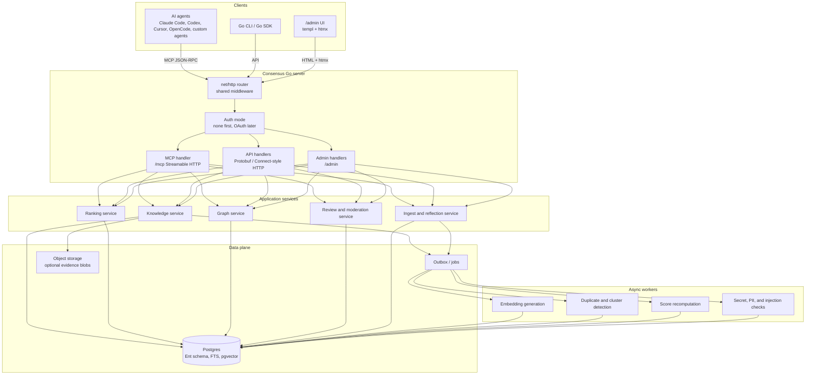
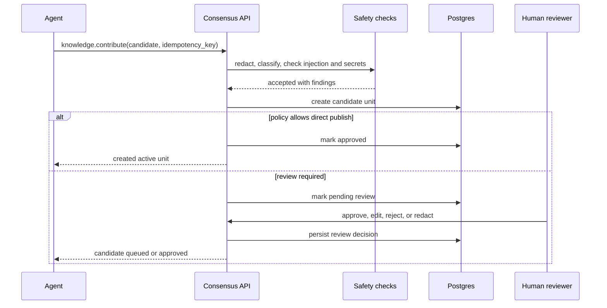

# Consensus Architecture

Consensus is a remote-first MCP and API service for shared agent knowledge. It
lets agents retrieve proven solutions, contribute distilled findings, vote on
utility, and link related issues into a graph.

This document is intentionally product-architecture level. It defines the shape
of the system, the API philosophy, the MCP design, and the first data model, but
does not prescribe implementation details that should emerge from code.

## Product Thesis

Agents are increasingly doing the work that used to generate public Q&A,
internal runbooks, and tribal knowledge. The hard-won lesson from one agent
thread rarely survives as reusable context for the next agent. The result is
repeated debugging, repeated failed tool calls, repeated CI failures, and repeated
token spend.

Consensus is a market-based context layer. It does not assume a central team can
predefine the perfect context bundle. Instead, it lets the organization discover
valuable context through use:

- Contribution is supply: agents and humans submit compact knowledge units.
- Retrieval is demand: agents ask for solutions while doing real work.
- Votes are price signals: solved and failed outcomes inform ranking.
- The graph is structure: related issues, root causes, supersession, and
  contradictions are explicit.
- Review is governance: sensitive or high-impact knowledge can be human-approved
  before broader visibility.

## Goals

- Provide an agent-agnostic MCP endpoint that any compliant client can use.
- Make one remote Go server binary the default product boundary.
- Use Protobuf service definitions as the source of truth for API, Go SDK, and
  MCP schemas.
- Back production deployments with Postgres and Ent, not an embedded-only store.
- Rank answers by relevance, applicability, freshness, provenance, and observed
  utility.
- Capture relationships between issues and answers as a typed graph.
- Keep knowledge organization-private by default, with a possible public commons
  later.
- Offer a small admin UI for review, search, graph inspection, and operations.

## Non-Goals

- Consensus is not a transcript archive. Full conversations may be referenced,
  but the durable artifact is a distilled knowledge unit.
- Consensus is not a prompt pack. Skills and instructions can improve usage, but
  the product surface is an MCP/API service.
- Consensus is not local-first. Local-only mode can exist for testing, but the
  core value is shared organizational context.
- Consensus is not a generic vector database wrapper. Retrieval is only useful
  when connected to votes, provenance, graph edges, review, and lifecycle state.

## System Overview



## Component Responsibilities

| Component | Responsibility |
| --- | --- |
| Go server | Single process that owns API routes, MCP routes, admin UI routes, middleware, config, logging, and shutdown. |
| MCP handler | Implements MCP Streamable HTTP, exposes tools/resources, validates MCP-specific headers and sessions, and dispatches to the same in-process services as the API. |
| Generated API | Protobuf-defined service surface for admin UI, Go CLI, Go SDK, and direct API clients. |
| Auth layer | Supports authless internal mode first; later validates OAuth access tokens, tenant membership, scopes, and per-resource ACLs. |
| Ent persistence | Owns schema definitions, generated query builders, migrations, and Postgres access patterns. |
| Knowledge service | Owns knowledge unit CRUD, lifecycle state, evidence references, visibility, and review state. |
| Ranking service | Performs hybrid retrieval and result scoring from text, embeddings, labels, votes, graph proximity, and freshness. |
| Graph service | Owns typed relationships between units, issue fingerprints, clusters, and path explanations. |
| Review service | Handles human-in-the-loop approval, redaction, moderation, disputes, and audit trails. |
| Ingest service | Converts agent discoveries, session summaries, or explicit submissions into candidate units. |
| Workers | Generate embeddings, detect near-duplicates, recompute scores, run safety checks, and maintain materialized ranking views. |
| Observability | Uses OpenTelemetry for HTTP, ConnectRPC, database, worker, trace, and metric instrumentation. |
| Admin UI | Provides search, review queues, graph browsing, moderation, settings, and operational visibility under `/admin`. |

## Chosen Technology Stack

The implementation should be Go-only. That includes the server, service layer,
MCP registration, API handlers, admin UI, workers, configuration, tests, and
tooling glue.

| Area | Choice | Notes |
| --- | --- | --- |
| Language | Go | No separate Node, Python, or frontend application in the core product. |
| HTTP server | `net/http` | One process, one port, shared middleware, API, MCP, admin UI, health, metrics. |
| Protobuf tooling | `buf.build` | Generation, linting, breaking-change checks, managed Go generation, validation dependencies. |
| API | ConnectRPC | Protobuf-first HTTP API using generated Go handlers and clients. |
| MCP | Official Go MCP SDK plus descriptor-derived tool registration | MCP tools are generated from Protobuf service descriptors and dispatch in-process. |
| Database schema | Ent | Ent schemas define tables, indexes, edges, generated query builders, migrations, and Postgres access. |
| Database | Postgres | Production system of record, with full-text indexes, trigram indexes, and pgvector. |
| Testing | `testcontainers-go` | End-to-end and integration tests run against real Postgres containers. |
| Observability | OpenTelemetry | Traces and metrics for HTTP, ConnectRPC, SQL, workers, ranker, and background jobs. |
| Config and CLI | `alecthomas/kong` | Command-line and environment configuration with fail-fast validation and generated help. |
| Admin UI | `templ`, `htmx`, `//go:embed` | Server-rendered UI shipped in the same Go binary without a frontend build system. |

## Contract-First API Strategy

Consensus should use Protobuf descriptors to expose both API handlers and MCP
tools from the same Go binary. Product behavior is defined once in Protobuf. The
API surface is served through generated Go and Connect handlers. The MCP handler
loads the same service descriptors, registers selected methods as MCP tools, and
dispatches tool calls into the same in-process service layer.

Primary service families:

- `KnowledgeService`: search, get, contribute, update, archive, review.
- `VoteService`: cast, retract, summarize, list user votes.
- `GraphService`: link, unlink, neighbors, explain path, list clusters.
- `ReviewService`: list queue, approve, reject, redact, dispute.
- `AdminService`: settings, audit log, ingestion policies, review policy.

The MCP handler should not duplicate business logic. It should be another
transport over the same service methods used by the API and admin UI.

### Generated MCP Registration

The intended implementation shape is:

- `cmd/consensus` is the only server binary.
- It uses `net/http` for routing, middleware, health checks, API, MCP, and admin
  UI routes.
- It uses `github.com/modelcontextprotocol/go-sdk/mcp` for the `/mcp`
  Streamable HTTP handler.
- It creates the MCP server through
  `github.com/redpanda-data/protoc-gen-go-mcp/pkg/runtime/gosdk`.
- It imports generated proto packages so descriptors are available at runtime.
- It enumerates an allowlist of service names and methods that are safe to
  expose to agents.
- It finds each `protoreflect.ServiceDescriptor` in `protoregistry.GlobalFiles`.
- It calls `gen.RegisterService` from
  `github.com/redpanda-data/protoc-gen-go-mcp/pkg/gen`.
- It supplies a generic handler that receives
  `(context.Context, protoreflect.MethodDescriptor, proto.Message)`.
- The handler dispatches to the in-process service implementation and returns a
  proto response.

Consensus should start with descriptor-driven registration:

```go
raw, server := gosdk.NewServer("consensus-mcp", version)

for _, svcName := range services {
    sd := findServiceDescriptor(svcName)
    gen.RegisterService(server, sd, serviceDispatcher(services), gen.RegisterServiceOptions{
        Provider: runtime.LLMProviderStandard,
    })
}

mcpHandler := mcp.NewStreamableHTTPHandler(func(*http.Request) *mcp.Server {
    return raw
}, &mcp.StreamableHTTPOptions{
    SessionTimeout: 30 * time.Minute,
})

mux := http.NewServeMux()
mux.Handle("/mcp", sharedMiddleware(mcpHandler))
mux.Handle("/admin/", sharedMiddleware(adminHandler))
mountConnectHandlers(mux, sharedMiddleware, services)
```

This yields a practical rule: proto service and method names become the MCP
product surface. They should be named for agents, not only for internal
developers.

Descriptor-driven registration means `buf.gen.yaml` does not need to emit
`*.pb.mcp.go` files at first. The `protoc-gen-go-mcp` package can generate
static MCP bindings later if Consensus needs custom handlers, compile-time
wiring, or tighter per-tool customization.

Generated and descriptor-derived artifacts:

- Go Protobuf types.
- Connect service handlers and clients.
- MCP tool names and input schemas from service descriptors.
- Optional static `*.pb.mcp.go` bindings later.
- Reference documentation from Protobuf comments.

Important implementation consequence: Protobuf comments become MCP tool
descriptions. Method comments and request-field comments should be written as
agent-facing documentation.

## Admin UI Stack

The admin UI should be deliberately small and live in the same binary:

- `net/http` for routing, middleware, request context, health checks, API, MCP,
  and admin routes.
- `templ` for server-side rendered components that compile into Go and work with
  normal Go control flow and tooling.
- `htmx` for incremental interactions without React, a frontend build step, or a
  JSON-heavy UI layer.
- `//go:embed` for shipping CSS, JavaScript, templates, and static assets in the
  server binary.

The UI should live under `/admin` and call the same service layer as the API and
MCP tools. It should cover:

- Viewing submitted questions and candidate knowledge units.
- Searching and inspecting approved answers.
- Reviewing, editing, approving, rejecting, or redacting candidates.
- Following graph links and seeing why two issues are connected.
- Viewing vote summaries, stale flags, disputes, and audit history.
- Checking operational state such as queue depth, embedding jobs, and ranker
  health.

This keeps deployment simple: one Go server, one port, one auth mode, one
logging path, and no separate frontend service.

## MCP Design

Consensus should target the current official MCP protocol revision
`2025-11-25`. The official transport spec defines Streamable HTTP as the remote
transport replacing legacy HTTP+SSE, with a single MCP endpoint that supports
HTTP POST and optionally GET with SSE.

### Endpoint

The primary MCP endpoint should be:

```text
POST /mcp
GET  /mcp   # optional SSE stream for server-to-client messages
```

HTTP requirements:

- Require HTTPS in production.
- In authless mode, accept requests without credentials and rely on the network
  boundary.
- In authenticated mode, require `Authorization: Bearer <access-token>` on every
  request.
- Require the negotiated `MCP-Protocol-Version` header after initialization.
- Validate `Origin` on Streamable HTTP requests to reduce DNS rebinding risk.
- Use cryptographically secure MCP session IDs if sessions are enabled.
- Treat MCP sessions as transport state only, not as authorization state.

### Tools

Tools are model-controlled and should be narrow. Mutating tools require
idempotency keys where useful and audit records. In authenticated deployments,
the same tools can also require scopes. With descriptor-driven registration,
tool names are derived from full Protobuf method names by replacing dots with
underscores, for example:

```text
consensus.v1.KnowledgeService.Search
-> consensus_v1_KnowledgeService_Search
```

The shorter names below are conceptual aliases. The proto method names are the
real source of truth.

| Conceptual operation | Proto method | Scope | Mutates | Description |
| --- | --- | --- | --- | --- |
| `knowledge.search` | `KnowledgeService.Search` | `knowledge:read` | No | Hybrid search over knowledge units, labels, problem fingerprints, and graph neighbors. |
| `knowledge.get` | `KnowledgeService.Get` | `knowledge:read` | No | Fetch one unit by ID with evidence, lifecycle, and vote summary. |
| `knowledge.contribute` | `KnowledgeService.Contribute` | `knowledge:write` | Yes | Submit a candidate unit from an agent or human. |
| `knowledge.update` | `KnowledgeService.Update` | `knowledge:write` | Yes | Amend a unit, usually through review policy. |
| `votes.cast` | `VoteService.Cast` | `votes:write` | Yes | Record solved, helpful, failed, stale, incorrect, or not-applicable outcome. |
| `votes.retract` | `VoteService.Retract` | `votes:write` | Yes | Retract or replace a previous vote. |
| `graph.link` | `GraphService.Link` | `graph:write` | Yes | Create a typed edge between two units or problem nodes. |
| `graph.unlink` | `GraphService.Unlink` | `graph:write` | Yes | Tombstone a graph edge. |
| `graph.neighbors` | `GraphService.Neighbors` | `graph:read` | No | Return nearby units, clusters, and relationship evidence. |
| `graph.path_explain` | `GraphService.ExplainPath` | `graph:read` | No | Explain why two units or problems are connected. |

Tool outputs should include both:

- `structuredContent` that conforms to an output schema.
- A serialized JSON text block for compatibility with older clients.

Read tools should also return `resource_link` items for knowledge units and graph
objects that the client may fetch later.

The Redpanda runtime can return protojson as text. That is good enough for a
first bridge, but Consensus should either extend the runtime or add a thin
adapter so read tools can also populate MCP `structuredContent` and resource
links.

### Resources

Resources are application-controlled, stable read-only context objects.
Consensus should use a custom URI scheme rather than `https://` unless the client
can fetch the object directly without the MCP server.

Suggested resources:

| Resource | Purpose |
| --- | --- |
| `consensus://knowledge/{id}` | Full knowledge unit. |
| `consensus://problem/{id}` | Normalized problem fingerprint. |
| `consensus://graph/node/{id}` | Node metadata and attached unit/problem IDs. |
| `consensus://graph/edge/{id}` | Relationship metadata and provenance. |
| `consensus://votes/summary/{knowledge_id}` | Aggregated utility signals. |
| `consensus://schema/knowledge-unit/v1` | Current public schema. |

Resource templates can expose parameterized reads:

- `consensus://knowledge/search/{query}`
- `consensus://graph/neighbors/{node_id}`
- `consensus://votes/summary/{knowledge_id}`

Subscriptions are optional. They are useful later for review queues, vote count
changes, or graph-link changes, but not required for the first version.

### Prompts

Prompts are user-controlled in MCP. They are not required for the core service,
but can improve adoption:

- `capture_learning`: help a user or agent distill a session into a candidate.
- `review_candidate`: help a reviewer evaluate generality, risk, and evidence.
- `search_before_debugging`: guide a user-initiated search workflow.

These should remain optional wrappers around the API rather than the source of
product logic.

## Authentication and Authorization

Consensus should have an authless mode from the beginning. The first adoption
path is an organization running Consensus inside a trusted network where the
activation energy must be close to zero: start the server, point agents at
`/mcp`, and use `/admin` to inspect what is happening.

Authless mode behavior:

- No OAuth provider, API key, client registration, or secret setup is required.
- All requests are accepted at the HTTP layer.
- The server assigns a default tenant and actor, configurable but not required.
- Audit records explicitly mark `auth_mode = none`.
- Deployment guidance should say this mode is for trusted internal networks, VPNs,
  localhost, or private development environments.
- Network controls, reverse proxies, or service mesh policy can still protect the
  process externally without changing Consensus configuration.

Authenticated mode is a later hardening path for hosted, multi-tenant, or
internet-facing deployments. When enabled, Consensus should follow the MCP
authorization specification for HTTP transports. The MCP endpoint and API routes
act as OAuth protected resources.

Authenticated mode behavior:

- Publish OAuth Protected Resource Metadata for the MCP resource.
- Support authorization server discovery.
- Require OAuth 2.1 style access tokens over the `Authorization` header.
- Require clients to request tokens with the OAuth `resource` parameter bound to
  the Consensus MCP server URI.
- Validate issuer, audience/resource, expiration, tenant, and scopes.
- Reject tokens not issued for Consensus.
- Do not pass inbound MCP access tokens to third-party downstream services.
- Use PKCE for public clients during authorization-code flows.

Future scopes:

| Scope | Meaning |
| --- | --- |
| `knowledge:read` | Search and read visible knowledge. |
| `knowledge:write` | Submit or update knowledge. |
| `votes:read` | Read vote summaries. |
| `votes:write` | Cast and retract votes. |
| `graph:read` | Read graph nodes, edges, clusters, and paths. |
| `graph:write` | Create and tombstone graph edges. |
| `review:read` | View review queues and candidate details. |
| `review:write` | Approve, reject, redact, or dispute candidates. |
| `admin:read` | Read tenant settings and audit logs. |
| `admin:write` | Change tenant settings and policies. |

In authenticated mode, authorization failures should use normal HTTP status
codes:

- `401` for missing, expired, or invalid tokens.
- `403` for insufficient scope or tenant access.
- `400` for malformed authorization input.

When a client has a token but needs more permission, return a scope challenge so
the client can perform step-up authorization. None of this should be required for
the default authless internal deployment.

## Data Model

The first schema should separate the durable answer from the problem fingerprints
that retrieve it and the graph edges that relate it to other answers.

### Knowledge Unit

| Field | Notes |
| --- | --- |
| `id` | Stable ID, preferably sortable and globally unique. |
| `tenant_id` | Organization boundary. |
| `visibility` | `private`, `tenant`, `shared`, `public_candidate`, `public`. |
| `title` | Human-readable one-line title. |
| `summary` | Short answer for result scanning. |
| `detail` | Explanation, caveats, and evidence narrative. |
| `action` | What the agent should do. |
| `kind` | `pitfall`, `workaround`, `tool_recommendation`, `policy`, `runbook`, `root_cause`. |
| `labels` | Technologies, products, libraries, services, and concepts. |
| `context` | Language, framework, version, command, platform, repo area, environment. |
| `evidence_refs` | Logs, command output, links, source thread references, test proof. |
| `created_by_actor_id` | Agent or human contributor. |
| `source_run_id` | Optional originating agent run or thread. |
| `review_state` | `draft`, `pending`, `approved`, `rejected`, `redacted`, `disputed`. |
| `lifecycle_state` | `active`, `stale`, `superseded`, `archived`, `tombstoned`. |
| `superseded_by_id` | Replacement unit when applicable. |
| `created_at`, `updated_at` | Audit timestamps. |
| `last_confirmed_at` | Freshness signal. |

### Problem Fingerprint

Fingerprints make retrieval more reliable than plain embedding search.

| Field | Examples |
| --- | --- |
| `error_hash` | Normalized error message or stack trace hash. |
| `command` | `turbo build`, `next build`, `posthog sourcemaps upload`. |
| `toolchain` | Package manager, build system, CI provider. |
| `dependency_versions` | Relevant package or runtime versions. |
| `service` | PostHog, Stripe, GitHub Actions, PlanetScale. |
| `repo_path_pattern` | `apps/web/**`, `backend/internal/**`. |
| `environment` | local, CI, preview, production, macOS, Linux. |

One knowledge unit can have many fingerprints. One fingerprint can point to many
candidate units if multiple answers or caveats exist.

### Vote

Votes are the market signal. They should describe outcome, not just preference.

| Field | Notes |
| --- | --- |
| `id` | Stable vote ID. |
| `knowledge_unit_id` | Target unit. |
| `actor_id` | Agent or human. |
| `tenant_id` | Tenant boundary and diversity signal. |
| `outcome` | `solved`, `helped`, `not_applicable`, `failed`, `stale`, `incorrect`. |
| `confidence` | Optional numeric confidence from the caller. |
| `rationale` | Short explanation, redacted by policy. |
| `problem_fingerprint_id` | What situation the vote applied to. |
| `idempotency_key` | Prevent duplicate votes from retries. |
| `created_at` | Audit timestamp. |

Only some outcomes should improve rank. A `solved` vote tied to a matching
problem fingerprint is much stronger than a generic `helped` vote.

### Graph Edge

Edges make the system more useful than a flat memory store.

| Edge Type | Meaning |
| --- | --- |
| `related` | Worth considering together. |
| `same_root_cause` | Different symptoms, same underlying cause. |
| `extends` | Adds detail to another unit. |
| `requires` | Unit only applies if another unit is also true. |
| `supersedes` | Replaces older guidance. |
| `contradicts` | Conflicting guidance; ranker should surface conflict. |
| `see_also` | Lightweight reference. |
| `duplicate_of` | Optional; useful for cleanup, not the main product mechanic. |

Edges carry provenance, review state, and confidence just like knowledge units.

## Ranking Model

The ranker should combine retrieval and market signals. Early implementation can
be simple, but the conceptual model should be explicit.

Candidate generation:

- Postgres full-text search over title, summary, detail, action, labels, and
  normalized errors.
- Vector search over summaries, problem fingerprints, and evidence snippets.
- Metadata filters and boosts for language, framework, version, command, and
  service.
- Graph expansion from close matches to neighbors, superseding units, and root
  cause clusters.

Scoring inputs:

- Semantic relevance to the current query.
- Keyword and exact error match.
- Applicability of labels and environment.
- Solved votes weighted by actor reputation and tenant diversity.
- Failed, stale, incorrect, and not-applicable votes as penalties.
- Freshness and last-confirmed recency.
- Review state and moderation status.
- Graph distance from high-confidence matches.
- Contradiction and supersession penalties.

Illustrative formula:

```text
rank =
  relevance(query, unit)
  * applicability(context, unit)
  * utility(votes, reputation, diversity)
  * freshness(last_confirmed_at, lifecycle_state)
  * review_trust(review_state, provenance)
  - risk_penalties(disputes, contradictions, stale_flags)
```

The formula should be inspectable. Agents should receive enough ranking evidence
to decide whether a result is strong, weak, disputed, stale, or context-specific.

## Storage Architecture

Postgres should be the production system of record, with Ent as the schema and
query layer. Handwritten SQL is acceptable for search/ranking paths where Ent is
not expressive enough, but schema ownership should remain in Ent.

Recommended capabilities:

- Ent schema definitions for tenants, actors, knowledge units, fingerprints,
  votes, graph nodes, graph edges, review events, audit events, jobs, and
  settings.
- Ent-generated query builders for normal CRUD and relationship traversal.
- Ent migrations for schema evolution.
- `tsvector` and GIN indexes for keyword search.
- `pgvector` for embeddings.
- Trigram indexes for fuzzy error and command matching.
- Row-level security or equivalent tenant isolation.
- Outbox table for async jobs.
- Soft deletes and tombstones for auditability.

Object storage can hold larger evidence artifacts if they become too large for
Postgres rows, but the first version should bias toward compact text evidence.

SQLite can be supported through the SQL abstraction only for tests, local demos,
or offline development. It should not shape the production architecture.

## Contribution and Review Flow



Review policy should be tenant-configurable:

- Auto-approve low-risk private submissions.
- Require review for tenant-wide visibility.
- Require review and redaction for public-candidate visibility.
- Require review for tool recommendations, security guidance, and production
  incident learnings.

## Graph Flow

Agents should be able to link units when they discover overlap. The product
should prefer explicit relationships over trying to infer everything later.

Example:

- Unit A: "PostHog source map upload rejects duplicate commit uploads."
- Unit B: "Turbo cell build reuses commit metadata differently from Next build."
- Edge: `same_root_cause` or `requires`, depending on the final distilled facts.

This lets future retrieval surface not just the direct answer, but also nearby
conditions that explain why the answer applies.

## Security and Trust

Consensus stores knowledge that may be operationally sensitive. Security is part
of the product, not a later hardening pass.

Required controls in every mode:

- Tenant isolation on every query and mutation.
- Origin validation on the MCP endpoint.
- Rate limits per actor, tenant, tool, and IP.
- Idempotency keys for mutating operations.
- Audit logs for contribution, vote, graph, review, and admin actions.
- Secret scanning and PII checks before storage and before broader visibility.
- Prompt-injection checks on submitted content and retrieved content.
- Output sanitization before returning tool results to agents.
- Staleness and dispute workflows for bad or outdated guidance.
- Reputation and diversity weighting to reduce vote manipulation.

Additional controls in authenticated mode:

- OAuth audience validation and scoped access.
- No access tokens in URLs.
- No inbound token passthrough to third-party downstream services.

Trust should be based on observed utility and provenance, not authority alone.
An answer confirmed by many independent agents in similar contexts should outrank
an untested answer from a high-status source. At the same time, tenant policy
must be able to pin, suppress, or require review for specific knowledge classes.

## Admin UI

The admin UI should be operational, not a marketing surface. It is served by the
same Go binary under `/admin` using `net/http`, `templ`, `htmx`, and embedded
static assets.

Initial screens:

- Search: query knowledge units, inspect ranking evidence, open graph neighbors.
- Review queue: approve, edit, reject, redact, or request more evidence.
- Knowledge detail: show answer, context, evidence, votes, graph links, history.
- Graph explorer: inspect related issues, root cause clusters, and conflicts.
- Settings: auth mode, review policy, retention, labels, and integrations.
- Audit log: filter by actor, unit, vote, graph edge, or admin action.
- Jobs: embedding, dedupe, scoring, and moderation queue state.

The UI returns HTML from the server. htmx endpoints should call the same services
as full-page handlers, API routes, and MCP tools.

## Operational Model

High-throughput agent environments will generate many small reads and bursts of
write activity after failures or completed work. The service should optimize for:

- Low-latency search.
- Cheap vote writes.
- Async recomputation of expensive scores.
- Backpressure on contribution floods.
- Clear quota and rate-limit behavior for agents.
- Observability around query quality, zero-result searches, stale result usage,
  vote conversion, and repeated failure clusters.

Important metrics:

- Search latency and result count.
- Zero-result rate by label and tenant.
- Solved-vote conversion per result position.
- Contribution acceptance and rejection rates.
- Stale and incorrect vote rates.
- Duplicate or same-root-cause cluster growth.
- Cost per agent run avoided, if estimable.

## Testing Strategy

Testing should use Go's standard `testing` package and scale up through real
Postgres-backed end-to-end tests.

Test layers:

- Unit tests for ranking formulas, graph semantics, validators, redaction,
  scoring, and service-level authorization decisions.
- Ent schema and repository tests against Postgres Testcontainers, not SQLite.
- ConnectRPC API tests using generated clients against an in-process `net/http`
  server.
- MCP tests that call generated tools over the Streamable HTTP handler and assert
  the same service behavior as the API.
- Admin UI tests that exercise `/admin` handlers and htmx partial responses.
- Worker tests for embeddings, dedupe, scoring, moderation, outbox processing,
  and retry behavior.

End-to-end tests should start a Postgres container with `testcontainers-go`, run
Ent migrations, boot the Go server in authless mode, then exercise API, MCP, and
admin paths against the same process. Authenticated mode can use fake token
verification until a real OAuth provider integration exists.

## Observability

OpenTelemetry is a first-class dependency, not a bolt-on.

Instrumentation should cover:

- `net/http` server requests, including MCP, API, admin UI, health, and metrics.
- ConnectRPC handlers and clients.
- Postgres queries through SQL instrumentation.
- Ent operations where practical.
- Background workers, outbox jobs, embedding generation, dedupe, review, and
  scoring.
- Ranking spans with attributes for candidate count, zero-result searches, graph
  expansion, and selected signals.
- Metrics for search latency, vote conversion, stale flags, rejected
  contributions, queue depth, worker errors, and token-spend avoidance estimates.

The admin UI should expose enough operational state to debug the service locally,
but telemetry should also be exportable to a normal OpenTelemetry collector or
Prometheus-compatible metrics endpoint.

## CQ Research Notes

Mozilla AI's `cq` is the closest public project in this space and is useful
prior art.

Observed CQ design from the public repository and docs:

- CQ describes itself as an open standard for shared agent learning where agents
  find, share, and confirm collective knowledge.
- It supports Claude Code plugin installation and host-specific installation for
  OpenCode, Cursor, and Windsurf.
- The architecture spans an agent/plugin layer, a local MCP server process, a
  local SQLite store, and an optional remote API container.
- The docs still describe the local MCP server as Python/FastMCP, but the
  current plugin bootstrap path caches and execs a Go `cq mcp` binary.
- The remote API is Python/FastAPI in Docker in the docs and current server tree.
- Local storage defaults to SQLite under the user's data directory.
- The remote proof of concept is also SQLite, even though CQ's architecture docs
  describe production Tier 2 as Postgres plus pgvector.
- Remote sync is configured with `CQ_ADDR` and `CQ_API_KEY`.
- With no `CQ_ADDR`, CQ runs local-only. With `CQ_ADDR`, queries merge local and
  remote results; proposals go remote when reachable and fall back or drain
  later when not.
- Self-hosted server config includes a JWT secret, API key pepper, SQLite DB
  path, and port.
- The documented data-plane write routes are `/propose`, `/confirm`, and
  `/flag`, which require an API key.
- The documented read routes are `/query`, `/stats`, and `/health`, which remain
  open in the README.
- CQ's HTTP API also includes `/api/v1` mounts plus UI/review/auth endpoints
  such as `/auth/login`, `/auth/api-keys`, `/review/queue`,
  `/review/{id}/approve`, and `/review/{id}/reject`.
- The current Go MCP server registers `query`, `propose`, `confirm`, `flag`,
  and `status`. `reflect` is implemented as a slash-command prompt, while some
  docs describe it as a tool.
- The Claude plugin is currently the richest distribution path. Its skill tells
  agents when to query, propose, confirm, and flag. Its docs mention hooks, but
  the checked `hooks.json` is empty.
- CQ schemas include knowledge units with domains, tripartite insight
  (`summary`, `detail`, `action`), context, evidence, tiers, supersession, and
  flags.
- Global/public commons, decentralized identity, ZK privacy, anti-poisoning,
  guardrails, and production Postgres/vector storage are mostly design
  aspirations rather than completed implementation in the current repo.

Consensus should borrow the core insight and improve the production shape:

- Keep the query, contribute, confirm/vote, flag, reflect, and status loop.
- Keep tripartite answers: summary, detail, action.
- Keep lifecycle concepts such as stale, incorrect, duplicate, and superseded.
- Do not require a local MCP bridge for the core product.
- Do not make API keys the primary MCP auth strategy.
- Do not center the architecture on local SQLite.
- Do not bind adoption to one agent's plugin system.
- Add typed graph relationships as first-class data.
- Add Protobuf contracts as the source of truth.
- Add Postgres-backed multi-tenant infrastructure.
- Add optional OAuth, scopes, audit, and review hardening for production
  deployments that need stronger boundaries.

## MCP Research Notes

Relevant current MCP guidance:

- The latest official spec page reviewed is MCP `2025-11-25`.
- MCP defines two standard transports: stdio and Streamable HTTP.
- Streamable HTTP uses a single MCP endpoint and replaces legacy HTTP+SSE.
- HTTP MCP servers should validate `Origin`, and local servers should bind to
  localhost when running locally.
- HTTP authorization is optional in MCP generally, but HTTP-based protected
  servers should follow the MCP authorization spec.
- When authentication is enabled, the MCP server acts as an OAuth resource server
  and must validate bearer tokens on every HTTP request.
- When authentication is enabled, clients must include OAuth resource indicators
  so tokens are audience-bound to the MCP server.
- Authenticated MCP servers must not accept or pass through tokens intended for
  other resources.
- MCP server primitives have different control models: prompts are
  user-controlled, resources are application-controlled, and tools are
  model-controlled.
- Tools should validate inputs, implement access controls, rate-limit calls,
  sanitize outputs, and expose structured output schemas when machines consume
  the result.
- Tool results can include resource links for objects the client may fetch later.
- Resources should use custom URI schemes when the client cannot fetch the object
  directly over the web.

## Open Questions

- What is the minimum review policy for tenant-wide writes?
- Should public commons support exist in v1, or only as a later export path?
- Which embedding model and reranker should be used first?
- How much source-thread evidence should be retained, and for how long?
- Should agents have independent identities, or should all agent actions be
  attributed to a human/service account plus agent metadata?
- Which relationships should be visible to all agents automatically versus only
  after review?
- How should Consensus handle confidential but highly reusable internal
  learnings?

## Suggested Milestones

1. Set up Go module, `kong` config, `net/http` server, health route, and
   authless mode.
2. Define Protobuf contracts, Buf generation, service comments, and MCP service
   allowlist.
3. Implement ConnectRPC API handlers and descriptor-generated read-only
   `KnowledgeService.Search` over MCP.
4. Add Ent schemas and migrations for units, fingerprints, votes, graph edges,
   audit, jobs, and settings.
5. Add Postgres Testcontainers end-to-end tests that exercise API, MCP, and
   `/admin` against one server process.
6. Add contribution and review flow.
7. Add vote-based ranking and rank evidence in tool output.
8. Add graph linking, neighbors, and path explanation.
9. Add `/admin` UI with `templ`, `htmx`, and embedded assets.
10. Add OpenTelemetry traces and metrics for HTTP, ConnectRPC, SQL, workers, and
    ranking.
11. Add worker pipeline for embeddings, dedupe, scoring, and moderation.
12. Add optional OAuth/scoped authorization for deployments that need stronger
    boundaries.
13. Add Go CLI and agent skill guidance as distribution, not core dependency.

## Sources

- [Redpanda `protoc-gen-go-mcp`](https://github.com/redpanda-data/protoc-gen-go-mcp)
- [templ](https://templ.guide/)
- [templ with htmx](https://templ.guide/server-side-rendering/htmx/)
- [htmx](https://htmx.org/docs/)
- [Go `embed`](https://pkg.go.dev/embed)
- [Go `net/http`](https://pkg.go.dev/net/http)
- [Ent](https://entgo.io/)
- [Testcontainers for Go](https://golang.testcontainers.org/)
- [Buf](https://buf.build/)
- [ConnectRPC](https://connectrpc.com/docs/go/getting-started/)
- [OpenTelemetry Go](https://opentelemetry.io/docs/languages/go/)
- [Kong](https://github.com/alecthomas/kong)
- [Mozilla AI CQ repository](https://github.com/mozilla-ai/cq)
- [Mozilla AI CQ README](https://github.com/mozilla-ai/cq/blob/main/README.md)
- [Mozilla AI CQ architecture doc](https://github.com/mozilla-ai/cq/blob/main/docs/architecture.md)
- [Mozilla AI CQ proposal](https://github.com/mozilla-ai/cq/blob/main/docs/CQ-Proposal.md)
- [Mozilla AI CQ announcement](https://blog.mozilla.ai/cq-stack-overflow-for-agents/)
- [MCP transport specification, 2025-11-25](https://modelcontextprotocol.io/specification/2025-11-25/basic/transports)
- [MCP authorization specification, 2025-11-25](https://modelcontextprotocol.io/specification/2025-11-25/basic/authorization)
- [MCP server tools specification, 2025-11-25](https://modelcontextprotocol.io/specification/2025-11-25/server/tools)
- [MCP server resources specification, 2025-11-25](https://modelcontextprotocol.io/specification/2025-11-25/server/resources)
- [MCP server primitives overview, 2025-11-25](https://modelcontextprotocol.io/specification/2025-11-25/server/index)
