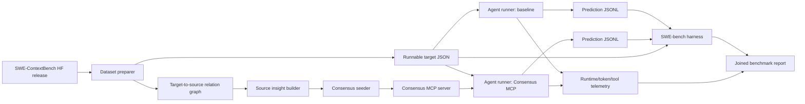

# SWE-ContextBench Benchmark Architecture

This document describes how Consensus should be evaluated on SWE-ContextBench as
an agent-agnostic MCP memory layer. The goal is not to chase a leaderboard
number first. The goal is to measure whether adding the Consensus MCP server to
an otherwise unchanged coding agent improves context reuse with low integration
overhead.

## Scope

Use SWE-ContextBench from Zhu, Hu, and Wu, not the separate
`Contextbench/ContextBench` dataset. The latter is a gold-code-context retrieval
benchmark; SWE-ContextBench is the one designed around reusing prior issue/PR
experience across related software engineering tasks.

Primary sources:

- Paper: <https://arxiv.org/abs/2602.08316>
- Dataset: <https://huggingface.co/datasets/jiayuanz3/SWEContextBench>
- Grader: <https://github.com/SWE-bench/SWE-bench>

As of April 26, 2026, the Hugging Face dataset contains:

| Artifact | Role | Observed shape |
| --- | --- | --- |
| `SWEContextBench.csv` | Relationship edges between runnable tasks and related prior tasks | 376 rows |
| `cases/SWEContextBench Lite.zip` | Lite runnable case JSON files | 99 JSON cases |
| `cases/SWEContextBench Full.zip` | Full runnable case JSON files | 357 JSON cases |

The paper describes 376 related tasks. The current released CSV has 376 relation
rows, while the full zip has 357 unique runnable case JSON files. Treat the CSV
as the relationship graph and the zip contents as the executable target set.

## Claim To Test

The primary claim is:

> Given the same model and coding agent, enabling the Consensus MCP server and
> seeding it with compact prior-task insights should improve task accuracy,
> runtime, or token cost on related tasks with minimal agent-specific
> integration.

The benchmark should isolate Consensus from unrelated changes. The agent,
model, prompt, timeout, repository checkout, and evaluator must stay fixed
between baseline and Consensus runs.

## Evaluation Conditions

Run at least these three conditions:

| Condition | MCP access | Context selection | Purpose |
| --- | --- | --- | --- |
| Baseline | None | None | Measures the unchanged agent/model. |
| Consensus Free Retrieval | Consensus MCP enabled | Agent chooses whether and what to retrieve | Primary product claim. |
| Oracle Summary Upper Bound | Consensus MCP enabled or direct injected context | Known related source insight is provided | Measures how much value exists if selection is perfect. |

Optional later conditions:

- Full trajectory reuse: store or inject long prior trajectories. This is useful
  for paper comparability but less aligned with Consensus, which aims to store
  compact durable insights.
- Metadata-only memory: seed only issue/PR titles and bodies, no source patch
  summaries. This is the most conservative leakage posture.
- Organic memory: first run base tasks with the agent, have it create Consensus
  insights, then evaluate related tasks using only those created insights.

## High-Level Architecture



## Data Model

### Target Cases

Each runnable target case is a SWE-bench-style JSON object from one of the zip
archives. It includes fields such as:

- `instance_id`
- `repo`
- `base_commit`
- `problem_statement`
- `patch`
- `test_patch`
- `FAIL_TO_PASS`
- `PASS_TO_PASS`

The agent may receive `repo`, `base_commit`, and `problem_statement`. It must
not receive the target `patch`, `test_patch`, `FAIL_TO_PASS`, or `PASS_TO_PASS`.
Those fields are reserved for grading.

### Relationship Edges

The CSV rows have:

- `instance_id`
- `pr_url`
- `issue_url`
- `related_instance_id`
- `related_pr_url`
- `related_issue_url`

For the current release, the runnable case JSON filenames match `instance_id`.
Use `related_instance_id` and its issue/PR URLs as the prior context candidates
for that runnable target.

Some targets have multiple related rows. Preserve all edges; do not collapse
them unless the reporting layer needs unique source counts.

## Source Insight Construction

Consensus should be seeded with compact insights representing prior solved
tasks. The seed corpus should be built from the related source side of the CSV,
not from the target solution.

Recommended seed tiers:

| Tier | Contents | Use |
| --- | --- | --- |
| T0 Metadata | Related issue/PR URL, title/body, repo, labels when available | Conservative first probe; least leakage risk. |
| T1 Gold Summary | T0 plus compact summary of the related source solution patch | Best initial product benchmark. |
| T2 Trajectory Summary | T1 plus summary from a previously recorded agent run | Closest to the paper's experience reuse setup. |
| T3 Organic Insight | Insight created by an agent after actually solving the prior task | Strongest product-valid setup; most expensive. |

Start with T1. It is simple, reproducible, and directly tests whether Consensus
can retrieve and present compact source-task lessons. Clearly label results as
`gold_seeded_summary`, because source patches are being summarized as prior
experience.

An insight should be shaped like this:

- `title`: short source issue/PR description.
- `problem`: source issue body or concise symptom.
- `answer`: one or two sentence durable lesson from the source fix.
- `action`: concrete future step an agent should try.
- `detail`: changed files, relevant behavior, caveats, and patch rationale.
- `tags`: repo, language, framework/library, issue family, changed files.
- `context`: `repo`, `source_instance_id`, `source_pr`, `source_issue`,
  `seed_tier`, and any known language/version.
- `links`: source issue, source PR, related target edge, evidence excerpt.

Do not store whole conversations by default. The benchmark should test compact
experience reuse, not long transcript stuffing.

## Setup

Required local tools:

- Docker, for the SWE-bench evaluator.
- Python 3.11+ with the SWE-bench harness installed.
- Go toolchain for the Consensus server.
- Postgres, usually through the local Docker Compose stack.
- An MCP-capable coding agent. Codex CLI is the preferred first runner because
  it can use Streamable HTTP MCP with very little custom integration.

Start Consensus locally:

```sh
task containers::up
```

Local endpoints:

- Admin: <http://localhost:8080/admin/>
- MCP: <http://localhost:8081/mcp>
- Health: <http://localhost:8080/healthz>

For Codex CLI, prefer isolated benchmark profiles so the baseline and Consensus
conditions do not accidentally share user-level MCP configuration.

Baseline profile:

- no Consensus MCP entry
- same model as the Consensus run
- same sandbox and approval settings

Consensus profile:

- one MCP server entry pointing at `http://localhost:8081/mcp`
- same model as baseline
- same sandbox and approval settings

## Harness Layout

Recommended future layout:

```text
benchmarks/swe_contextbench/
  download.py
  prepare_dataset.py
  build_source_insights.py
  seed_consensus.py
  run_agent.py
  evaluate.py
  report.py
  prompts/
    baseline.md
    consensus.md
    oracle_summary.md
```

Generated benchmark data should live outside source-controlled docs, for
example:

```text
.bench/swe-contextbench/
  raw/
  prepared/
  consensus-seed/
  runs/
    lite-baseline/
    lite-consensus-free/
    lite-oracle-summary/
```

## Dataset Preparation

Preparation should:

1. Download the CSV and selected zip archive.
2. Extract only real case JSON files, ignoring `__MACOSX` entries.
3. Emit a local SWE-bench-compatible dataset JSON:

   ```text
   .bench/swe-contextbench/prepared/lite.targets.json
   ```

4. Emit the relation graph:

   ```text
   .bench/swe-contextbench/prepared/lite.edges.json
   ```

5. Validate the counts:

   - Lite target JSON count should be 99.
   - Full target JSON count should be 357 for the current release.
   - CSV relation row count should be 376.

Before any model run, validate a small set with gold patches through the
SWE-bench harness. On Apple Silicon or other ARM machines, expect to build local
images rather than pulling the default Linux images.

## Retrieval Probe

Run a retrieval-only probe before spending on full agent runs.

For each target:

1. Search Consensus with the target `problem_statement`.
2. Include structured context such as `repo`.
3. Record the top-k returned insight source IDs.
4. Compare those IDs with the CSV `related_instance_id` set for that target.

Report:

- top-1 related-source recall
- top-3 related-source recall
- top-5 related-source recall
- mean reciprocal rank
- empty-result rate
- average returned insight length

If top-5 recall is weak, full agent runs will mostly measure retrieval failure.
Improve seeding, tags, and ranking before scaling the benchmark.

## Agent Runs

Each agent run should:

1. Create a fresh repository checkout at `base_commit`.
2. Present only the task problem statement and normal instructions.
3. For the Consensus condition, expose the MCP server and instruct the agent to
   search for prior relevant insights before deep exploration.
4. Forbid test-file edits unless a specific experiment intentionally allows
   them.
5. Stop on timeout.
6. Capture the final git diff.
7. Write a prediction record:

   ```json
   {
     "instance_id": "django__django-30153",
     "model_name_or_path": "codex-gpt-5-consensus-free",
     "model_patch": "diff --git ..."
   }
   ```

Use JSONL for predictions so interrupted runs can be resumed safely.

For Codex CLI, the runner should invoke the same command shape for both
conditions and vary only the profile/config:

```sh
codex exec \
  --json \
  --ephemeral \
  --cd "$CHECKOUT_DIR" \
  --model "$MODEL" \
  "$PROMPT"
```

The runner should persist the raw event stream. It is needed for token/cost
accounting, MCP tool-call counts, and debugging.

## Grading

Use the SWE-bench harness to grade prediction files against the prepared local
dataset:

```sh
python -m swebench.harness.run_evaluation \
  --dataset_name .bench/swe-contextbench/prepared/lite.targets.json \
  --split test \
  --predictions_path .bench/swe-contextbench/runs/lite-consensus-free/predictions.jsonl \
  --max_workers 4 \
  --run_id lite-consensus-free
```

Use the same evaluator command for baseline and Consensus predictions, changing
only `--predictions_path` and `--run_id`.

## Metrics

Accuracy:

- patch application failure rate
- `FAIL_TO_PASS` test-level pass rate
- `PASS_TO_PASS` test-level pass rate
- `FAIL_TO_PASS` task-level pass rate
- `PASS_TO_PASS` task-level pass rate
- resolved rate

Efficiency:

- wall-clock time from agent start to patch extraction
- evaluator runtime separately from agent runtime
- median, p75, and p95 runtime
- runtime on baseline-slow tasks

Cost:

- input tokens
- output tokens
- cache-read/cache-write tokens when available
- estimated API cost
- cost per resolved task

Consensus-specific:

- MCP searches per task
- MCP gets per task
- average returned insight count
- average returned insight token length
- top-k relation hit rate
- outcome records created after successful or failed use

Integration overhead:

- agent-specific config lines
- extra prompt lines
- time to configure MCP
- amount of custom harness code needed beyond generic MCP configuration

## Reporting

The final report should join:

- SWE-bench grading reports
- agent runtime logs
- token/cost accounting
- MCP tool-call logs
- retrieval probe metrics
- relation graph metadata

Minimum report tables:

1. Baseline vs Consensus Free Retrieval vs Oracle Summary.
2. Per-repository outcomes.
3. Retrieval hit vs task resolution correlation.
4. Runtime and cost deltas for baseline-slow tasks.
5. Failure categories: no retrieval, wrong retrieval, relevant retrieval not
   used, patch failed, tests failed, timeout.

The primary comparison should be paired by `instance_id`, not only aggregate
averages.

## Guardrails

- Never seed Consensus with target `patch` or `test_patch`.
- Never include target test names in the agent prompt.
- Keep baseline and Consensus prompts identical except for MCP availability.
- Run targets independently; no hidden carryover between tasks except through
  the explicit Consensus server.
- Use a fresh database per benchmark run or namespace all seed data by run ID.
- Persist exact model name, model version, prompt, dataset SHA, and Consensus
  commit.
- Treat current dataset counts as release-specific facts and revalidate on each
  download.

## Initial Milestones

1. Prepare Lite target dataset and relation graph.
2. Seed T1 compact source insights into Consensus.
3. Run retrieval-only top-k probe.
4. Improve ranking until top-5 related-source recall is credible.
5. Run 10-task smoke test for baseline and Consensus.
6. Grade with SWE-bench harness and verify logs.
7. Run all 99 Lite tasks.
8. Decide whether Full is worth running based on Lite effect size and cost.

## Expected Interpretation

The most useful early result is not simply a higher resolved rate. A strong
Consensus signal would look like:

- modest or better resolved-rate improvement,
- lower median or tail runtime,
- lower token cost per resolved task,
- larger gains on tasks where baseline spends a long time exploring,
- clear correlation between retrieving the known related source insight and
  solving or speeding up the target task.

If Consensus Free Retrieval underperforms while Oracle Summary improves, the
memory representation is useful but retrieval/ranking needs work. If both fail,
the stored summaries are not actionable enough or the benchmark relation does
not transfer well for the chosen agent/model.
